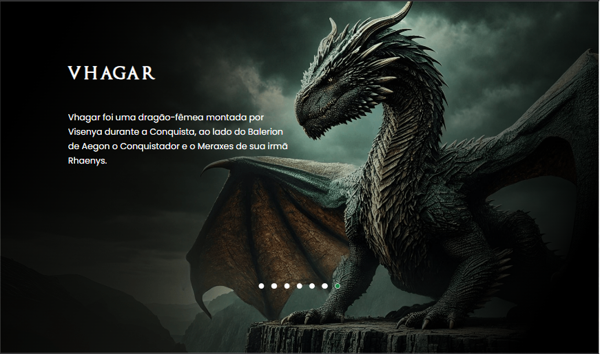

[]
[]

<h1>Projeto Hause of The Dragons </h1> 

> Primeiro projeto iniciando minha aventura na area da programação, evento  "Semana do Zero ao programador contratado" Obrigado Gemeos DEV-QUEST foi meu ponto inicial nesse novo projeto de vida....viver de Tecnologia.

<h2>Tecnologias Utilizadas<h2>

 
  
  
  

**Gostaria de expressar minha gratidão por ter concluído meu primeiro projeto utilizando HTML, CSS e JavaScript. Essa jornada tem sido de grande aprendizado e desafios superados, e estou profundamente agradecido por todas as oportunidades que surgiram ao longo desse processo.**

**A cada linha de código, pude perceber as inúmeras possibilidades que essas tecnologias oferecem, permitindo a criação de soluções inovadoras e funcionais**. 

**Esse projeto é apenas o começo de um caminho repleto de novas descobertas e desenvolvimento contínuo. Estou animado para continuar aprimorando minhas habilidades e explorar ainda mais o potencial de cada uma dessas ferramentas.**

[]